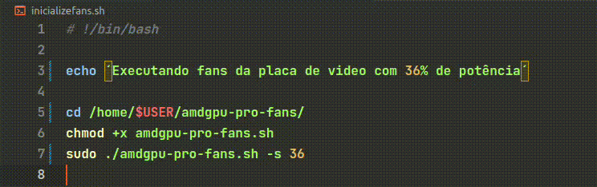

## Inicializador automático das fans da placa de video AMD no sistema operacional Linux Ubuntu 22.04

### Requisitos para iniciar o projeto

- [git](https://git-scm.com/)

### Descrição

#### O Script ( service-create ) vai criar um serviço de inicialização automática das fans da placa de video

<br>

#### Para modificar a velocidade que as ventoinhas vai rodar ao iniciar você devera entrar no arquivo ( inicializefans.sh ) e modificar o numero que esta na frente do ( ./amdgrpu-pro-fans.sh -s )



<hr>

### Iniciando o projeto

#### Para o script iniciar junto com o sistema operacional voce precisa colocar a pasta na raiz do sistema operacional

```bash
$ cd /
## Clone o projeto
$ sudo git clone https://github.com/rafaelmasselli/Start-AMD-graphics-card-fans-ShellScript
```

### Iniciando o Script

```bash
sudo chmod +x service-create.sh
sudo ./service-create.sh
```

- [Referências](./referencias.md)
